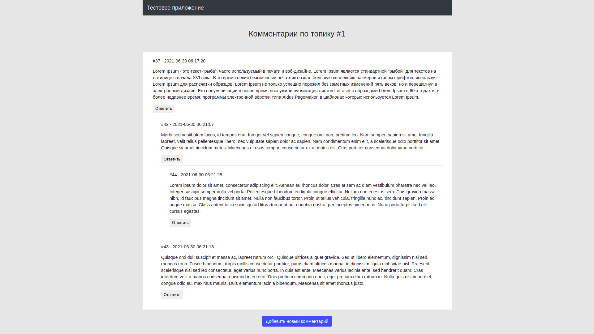
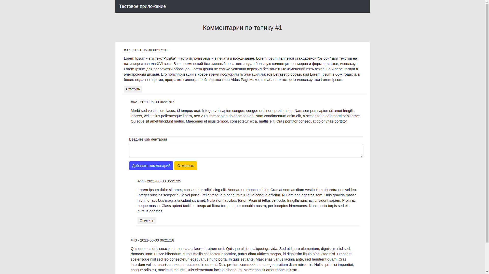

## Старт тестового проекта ##

1. Запустить команду в корне проекта `make up` или для первого запуска `make init`
2. Приложение будет доступно по ссылке http://127.0.0.1:8080/?topic_id=1

### Список комментариев ###

### Добавление нового комментария ###

